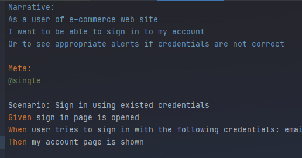

# Web tests

## Website under the test

http://automationpractice.com/index.php

The following test cases are automated:

1. Scenario: Sign in using existed credentials:
    * Given: sign in page is opened
    * When: user tries to sign in with the test user credentials: email = bodaganj@gmail.com and password = Qazqaz123
    * Then: my account page is shown

Automated test - src/test/resources/stories/login/SignIn.story

2. Scenario: Sign in using incorrect credentials
    * Given: sign in page is opened
    * When: user tries to sign in with the incorrect credentials: email = wrongEmail and password = fakePassword
    * Then: appropriate alert is shown

Automated test - src/test/resources/stories/login/SignIn.story

3. Scenario: Add one product to shopping cart
    * Given: product (product id = 1) page is open
    * When: product is added to shopping cart
    * Then: 1 product is present on shopping cart

Automated test - src/test/resources/stories/shopping.cart/AddProductToCart.story

4. Scenario: Remove the only product from Shopping cart
    * Given: product (product id = 1) page is open
    * When: product is added to shopping cart
    * And: 1 product is present on shopping cart
    * And: following product is removed from shopping cart: productI = 1
    * Then: shopping cart is empty

Automated test - src/test/resources/stories/shopping.cart/RemoveProductFromCart.story

*Note:* there are a lot of test cases to be covered additionally. Several cases are automated only.

## Tech stack

* Java 11
* JBehave
* Serenity
* maven
* git/github

JBehave is used in order to have test cases/stories written in easy to read format (for both technical and not technical persons). Serenity
is used as a WebDriver wrapper.

## How to run tests

1. Run all stories manually
    * manually - run ```src/test/java/com/bitpanda/launcher/SerenityStoriesLauncher.java``` as a simple JUnit test
    * maven - run ```mvn clean verify```
2. Run single story
    * same steps to execute, but the following annotation ```@Metafilter("+single")``` should be added
      to ```src/test/java/com/bitpanda/launcher/SerenityStoriesLauncher.java```
      and appropriate story should be marked with the following tag ```Meta: @single```
      E.g.:
      
      

      

*Note:* be aware that tests are executed using chrome browser in a headless mode. In order to disable this mode pls
remove ```chrome.switches``` property within the ```serenity.properties``` file

## How to get Serenity reports

If tests are executed with help of maven, then allure report is created automatically. You can find it
under ```${project.basedir}/target/site/index.html```

## Link to CI on GitHub

https://github.com/bodaganj/BitpandaWebsiteTesting/actions/workflows/mavenFinal.yml


